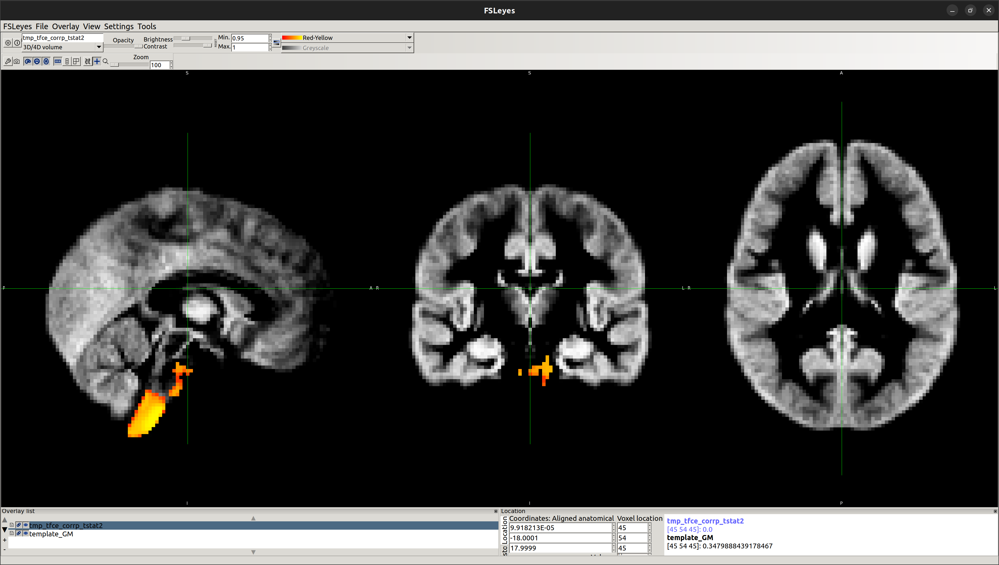
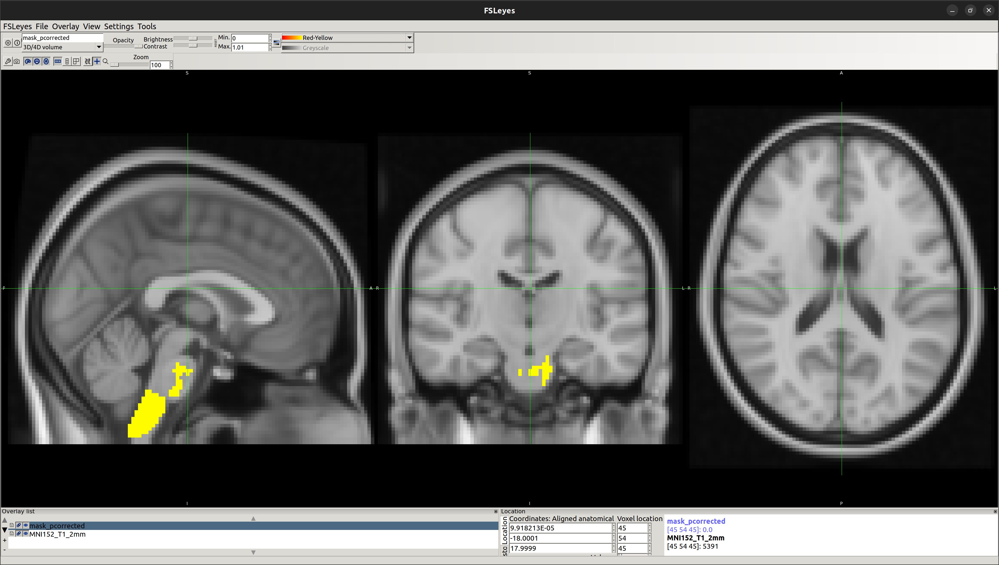
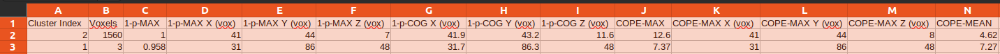
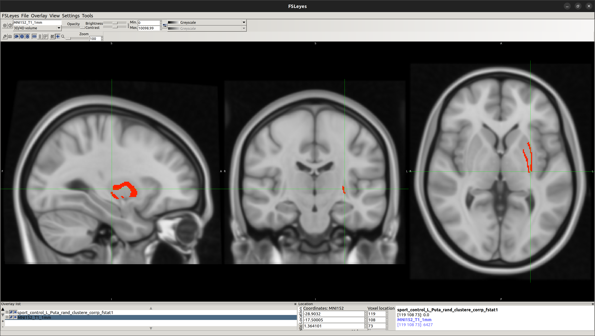
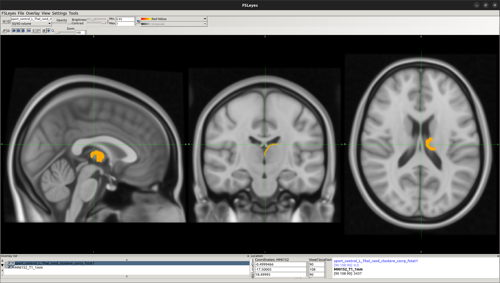

## Multimodal Investigation of Neural Correlates of Athletic Performance ##
**BrainHack School 2023 Project**

**Keywords:**
fMRI, FSLVBM, dMRI Analysis in Python

## Project definition

### Background
The relationship between athletic performance and brain structure and function has been a topic of interest in the field of neuroscience. Understanding the neural correlates of athletic performance can provide valuable insights into the development of training programs and interventions to enhance physical and cognitive abilities. In this project, I propose to use functional magnetic resonance imaging (fMRI), diffusion MRI (dMRI), and FSL's Voxel-Based Morphometry (FSLVBM) to investigate the differences in grey matter volume and white matter connectivity between elite athletes and non-athletes. I will perform the analysis using Python-based tools, such as Nilearn and Dipy.  

### Goals of the Project
[1] Identify brain regions associated with athletic performance by comparing grey matter volume between elite athletes and non-athletes using fMRI and FSLVBM.

[2] Investigate white matter connectivity differences between elite athletes and non-athletes using dMRI and tractography analysis in Python.

[3] Explore the relationship between grey matter volume, white matter connectivity, and specific athletic skills (endurance, strength, agility).

### Tools
This project relied on numerous tools such as:
1. Git and Github for Version Control
2. FSLVBM to preprocess and analyse grey matter volume differences
3. FSL FIRST tool for automatic segmentation of a number of subcortical structures.
4. Python-based tools, such as Dipy and Nilearn, to preprocess the data, perform tractography analysis, and investigate white matter connectivity differences
5. Google Colab and Jupyter Notebook

### Data
I've used a publicly available dataset on college-level athletes for this project. From the dataset, I have chosen data of nine Indiana University (IU) football players (American football) and nine controls (non-athletes) and wish to carry out an AmFB>NonAth comparison as well as NonAth>AmFB comparison.

Please check the Participants' Info Used in this Project here:
Results/Participants_INFO.csv

Information about Dataset:
https://www.nature.com/articles/s41597-021-00823-z

Link to download the dataset:
https://brainlife.io/pub/5f2c3765beafe924c962dd8d

### Deliverables
At the end of this project, these files will be made available:
- Reproducible project workflow, detailed in the GitHub repository with codes
- Jupyter notebooks of the analysis codes and visualisations
- Figures of the results

## Results

### Progress overview
```Date: 2023 June 10```

**Data Preprocessing**
> MRI data have been preprocessed using FSL tools.


**Voxel-Based Morphometry (VBM) Analysis**
> Grey matter volume differences between athletes and non-athletes have been investigated using FSLVBM [FMRIB's Software Library - Voxel-Based Morphometry]

OUTPUT

NonAth>AmFB

Showing the local differences in grey matter volume between the two groups:



To obtain statistical data, identify the region of significant difference and validate that:

[1] E2 - Running randomise and displaying cluster-based thresholding results
> Reference: https://fsl.fmrib.ox.ac.uk/fsl/fslwiki/FSLVBM/UserGuide

OUTPUT



[2] Reporting Cluster Information
> Reference: https://fsl.fmrib.ox.ac.uk/fsl/fslwiki/Cluster#reporting

OUTPUT



**Vertex Analysis**
> Automated segmentation of subcortical structures in the brain has been completed using FSL FIRST [a model-based segmentation/registration tool] tool for the following brain regions:
- Left-Thalamus
- Left-Caudate
- Left-Putamen
- Left-Pallidum
- Brain-Stem /4th Ventricle
- Left-Hippocampus
- Left-Amygdala
- Left-Accumbens
- Right-Thalamus
- Right-Caudate
- Right-Putamen
- Right-Pallidum
- Right-Hippocampus
- Right-Amygdala
- Right-Accumbens

OUTPUT


Using this vertex analysis, marked differences in shape have been found in the two following areas: 

[1] Left-Putamen



[2] Left-Thalamus



IMPORTANT
All the analyses and codes have been documented in the two following notebooks:
- Results/fslvbm_analysis_american_football.ipynb
- Results/fsl_FIRST_analysis_american_football.ipynb

However, due to the large size of the images, once you try to open them in GitHub, it may show that "The notebook took too long to render". In that case, you may download the raw file and open them in VS Code or Jupyter Notebook. Else, I'm providing here the links to these two notebooks in the Google Colab:
- fslvbm_analysis_american_football.ipynb
  - https://colab.research.google.com/drive/1vhhklbIwlF43ZjesHvKfJq0AFG5USa2b?usp=sharing
- fsl_FIRST_analysis_american_football.ipynb
  - https://colab.research.google.com/drive/1i51mnQyyXjHEzhikUBsRbwfXv_k-wLHr?usp=sharing
Thank you. 

### Future Work
**dMRI Analysis in Python**
> White matter connectivity will be explored using tractography methods implemented in Python-based tools such as Dipy and Nilearn.


## References
### Tools / Tutorials 
**FSLVBM**

1. https://fsl.fmrib.ox.ac.uk/fsl/fslwiki/FSLVBM
2. https://fsl.fmrib.ox.ac.uk/fsl/fslwiki/FSLVBM/UserGuide
3. https://www.youtube.com/watch?v=L1B3Wm-wnyQ&ab_channel=FSLCourse

**dMRI Analysis in Python**

1. https://school-brainhack.github.io/modules/dmri_intro/
2. https://davi1990.github.io/talks/2021-11-05-dMRI_analysis_in_Python
3. https://carpentries-incubator.github.io/SDC-BIDS-dMRI/aio/index.html

**Relevant Research Papers**

1. https://www.frontiersin.org/articles/10.3389/fnhum.2014.00594/full
2. https://www.sciencedirect.com/science/article/pii/S0960982214009798
