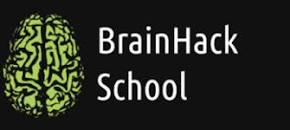

## Multimodal Investigation of Neural Correlates of Athletic Performance ##
**BrainHack School 2023 Project**

**Keywords:**
fMRI, FSLVBM, dMRI Analysis in Python

## Short Description of the Project
The relationship between athletic performance and brain structure and function has been a topic of interest in the field of neuroscience. Understanding the neural correlates of athletic performance can provide valuable insights into the development of training programs and interventions to enhance physical and cognitive abilities. In this project, I propose to use functional magnetic resonance imaging (fMRI), diffusion MRI (dMRI), and FSL's Voxel-Based Morphometry (FSLVBM) to investigate the differences in grey matter volume and white matter connectivity between elite athletes and non-athletes. I will perform the analysis using Python-based tools, such as Nilearn and Dipy.  

## Goals of the Project
[1] Identify brain regions associated with athletic performance by comparing grey matter volume between elite athletes and non-athletes using fMRI and FSLVBM.

[2] Investigate white matter connectivity differences between elite athletes and non-athletes using dMRI and tractography analysis in Python.

[3] Explore the relationship between grey matter volume, white matter connectivity, and specific athletic skills (endurance, strength, agility).

## Project Progress
```Date: 2023 June 10```

**Data Preprocessing**
> MRI data have been preprocessed using FSL tools.

**Voxel-Based Morphometry (VBM) Analysis**
> Grey matter volume differences between athletes and non-athletes have been investigated using FSLVBM [FMRIB's Software Library - Voxel-Based Morphometry]

**Vertex Analysis**
> Automated segmentation of subcortical structures in the brain has been completed using FSL FIRST [a model-based segmentation/registration tool]

### Things to do:
**dMRI Analysis in Python**
> White matter connectivity will be explored using tractography methods implemented in Python-based tools such as Dipy and Nilearn.

## Data and Tools to Use 
Publicly available dataset on college-level athletes

Information about Dataset:
https://www.nature.com/articles/s41597-021-00823-z

Link to download the dataset:
https://brainlife.io/pub/5f2c3765beafe924c962dd8d

Python, FSLVBM, Nilearn, Dipy




## References
### Tools / Tutorials 
**FSLVBM**

[1] https://fsl.fmrib.ox.ac.uk/fsl/fslwiki/FSLVBM

[2] https://fsl.fmrib.ox.ac.uk/fsl/fslwiki/FSLVBM/UserGuide

[3] https://www.youtube.com/watch?v=L1B3Wm-wnyQ&ab_channel=FSLCourse

**dMRI Analysis in Python**

[1] https://school-brainhack.github.io/modules/dmri_intro/

[2] https://davi1990.github.io/talks/2021-11-05-dMRI_analysis_in_Python

[3] https://carpentries-incubator.github.io/SDC-BIDS-dMRI/aio/index.html

**Relevant Research Papers**

[1] https://www.frontiersin.org/articles/10.3389/fnhum.2014.00594/full

[2] https://www.sciencedirect.com/science/article/pii/S0960982214009798
